# UI design（界面设计）
| 版本 |   日期    | 描述 |  作者   |
| :--: | :-------: | :--: | :-----: |
| v1.1 | 2019-6-8 | 界面设计 | Yuefengxin |  

整个平台的界面设计都是偏清新风格的，以下是每个单独的界面  
### 登录注册界面

  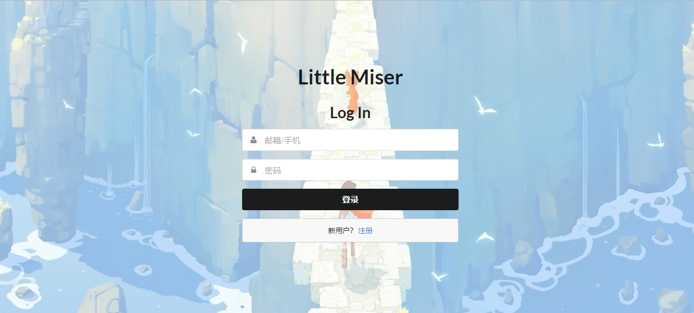  

- 注册界面可以选择学生、机构两种角色  

  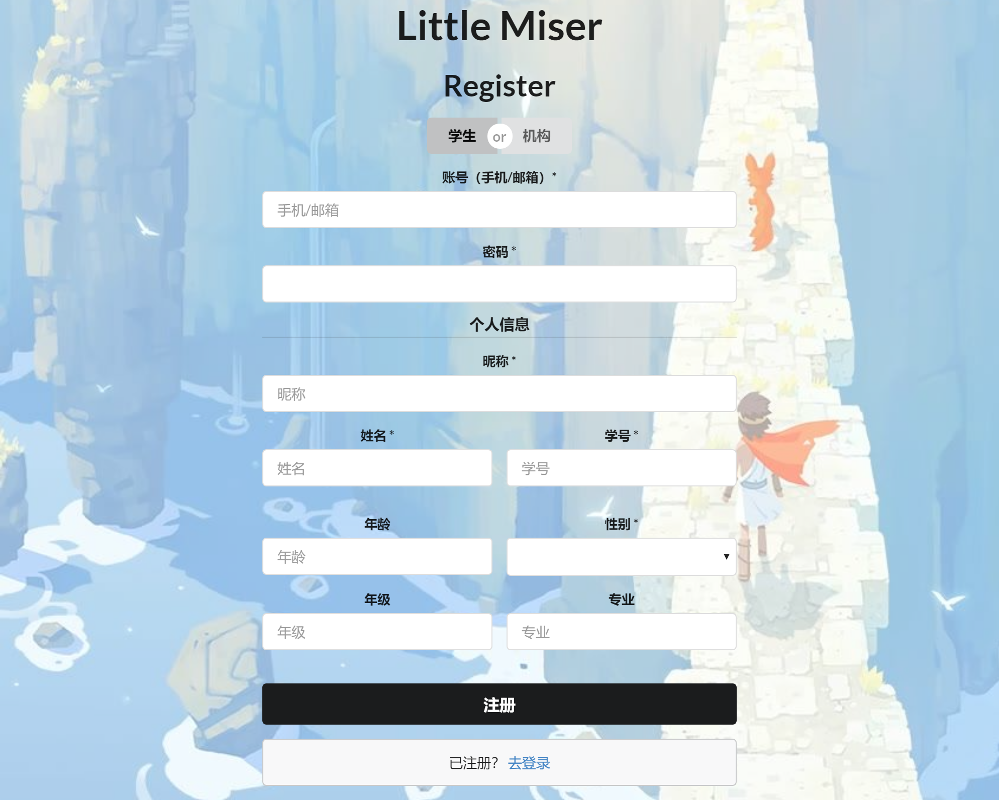

### 平台主页
- 侧边栏包括功能导航。默认进入发布任务功能，有两个选择：发布问卷、发布快递

  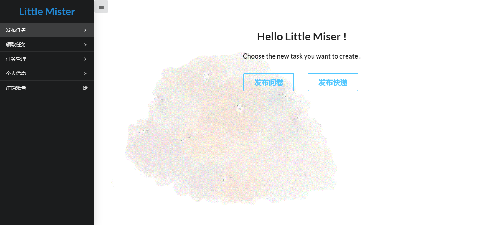

### 发布任务界面
- 发布问卷页面，包括所有需要填写的信息表单，以及发布按钮

  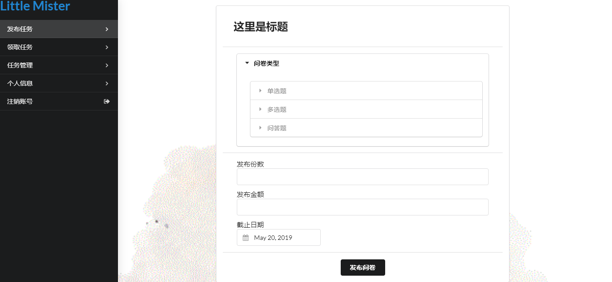

- 发布快递页面，包括所有需要填写的信息表单，以及发布按钮

  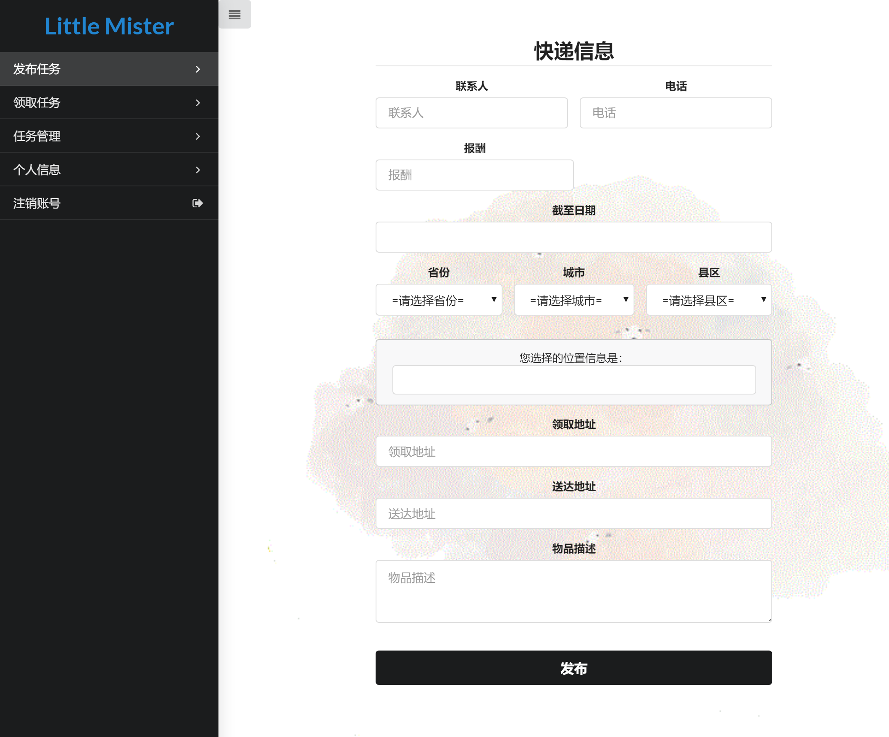

### 领取任务界面
- 领取任务界面，可以领取问卷任务/快递任务

  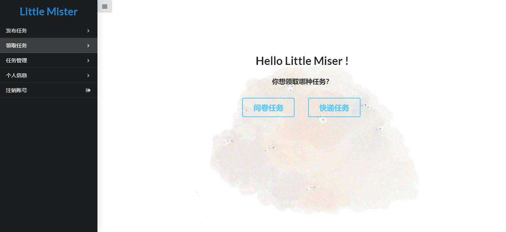

- 领取问卷任务界面，包括搜索栏可以对问卷的名字进行搜索。

  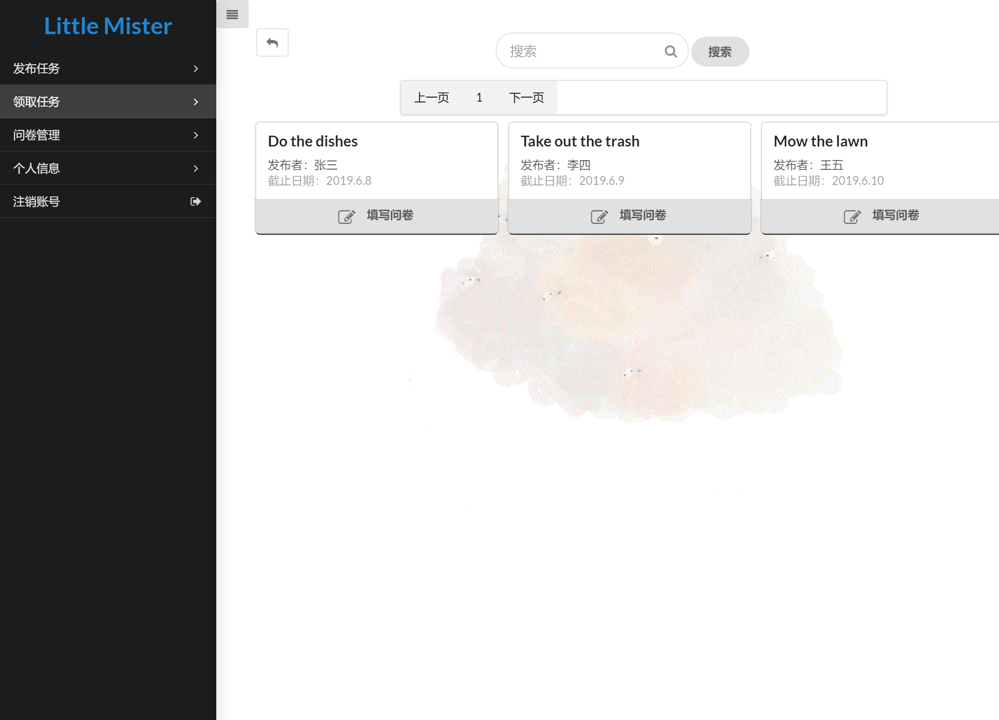
- 领取快递任务界面，包括下拉栏可以选择大体位置，以及搜索栏可以对快递的地址进行搜索。
  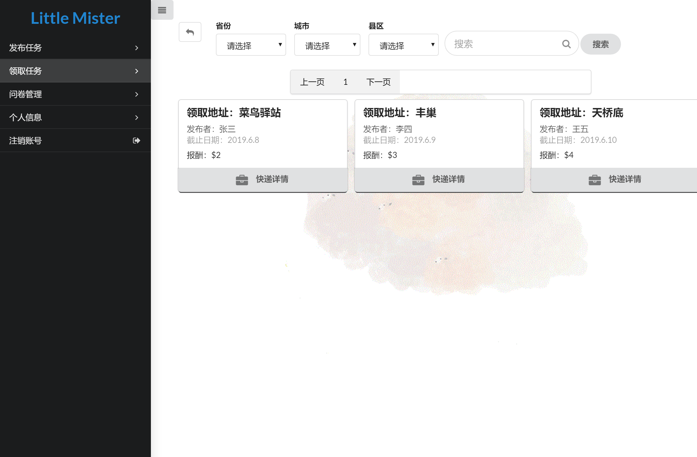

### 管理任务界面
- 任务管理页面，可以管理用户接受、发布的快递/问卷任务

  

- 快递任务界面，每一行有下拉栏，包括查看详情按钮、删除任务按钮。右下角已发布和已接受按钮可以切换查看已发布和已接受的任务。

  

- 问卷任务界面，每一行有下拉栏，包括查看统计、删除任务按钮。

  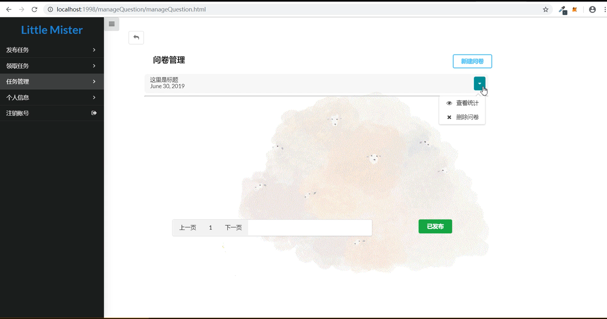  
  
- 查看统计页面，单选题使用饼图，多选题使用条形图，文本题直接显示答案

  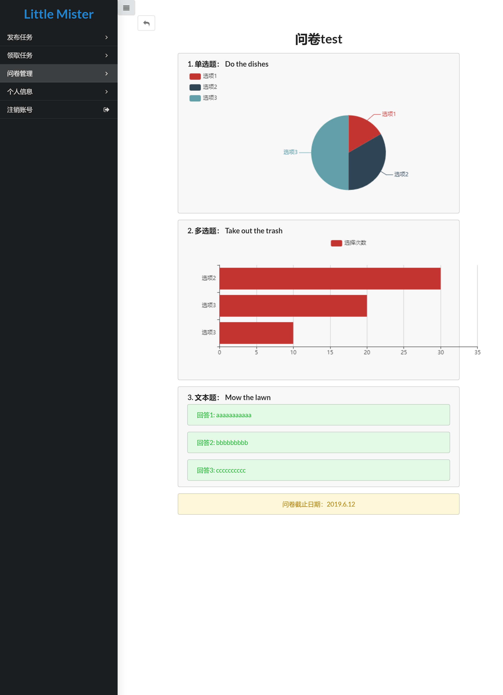  

- 个人信息页面，包括一个修改按钮，可以修改个人信息和密码

  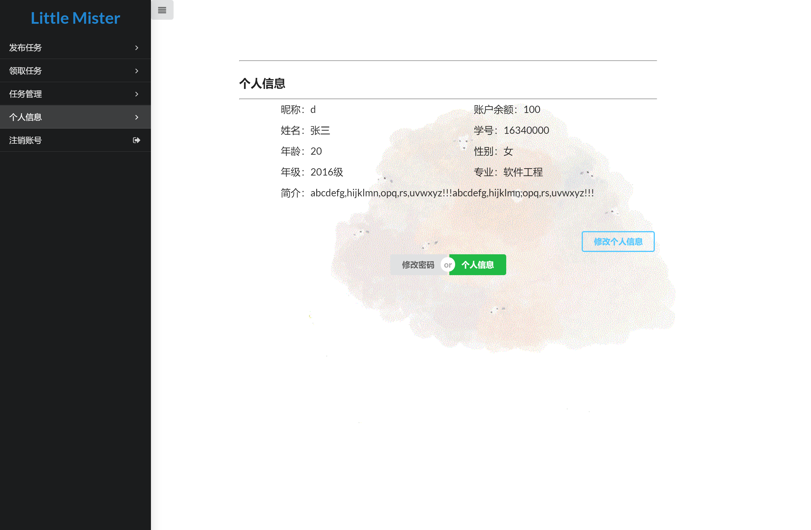

