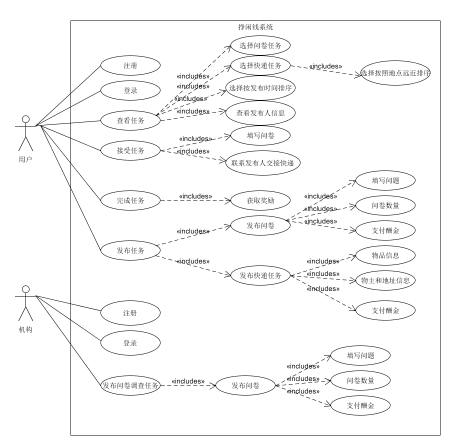

# 项目启动会议记录

`2019/4/14 16:00 - 17:20`

**会议目标：**
讨论Inception阶段的任务

## 讨论内容
1. 确定项目所支持的业务，除了问卷调查，还做什么？
2. 项目实现形式，微信小程序还是安卓app？
3. 前期具体做哪些调研，可行性分析（市场、竞品）？
4. 讨论项目愿景，要考虑哪些系统特性？项目的竞争趋势分析
5. 讨论业务流程，建立初步用例模型
6. 小组人员如何分工？
7. 确定需要用到哪些技术？可以开始做什么准备？

## 讨论结果
1. 确定项目支持的业务：  
项目基本要求是系统必须支持问卷调查业务，至少一项其他业务。我们在取外卖和取快递之间选择其一，最后选择了时间宽容度更高的取快递业务。

2. 项目实现形式：  
我们决定将项目做成APP或者微信小程序，APP是因为小组部分同学已经有安卓开发的基础，进行起来会比较顺利。但是对于之后的服务端搭建，大家希望比较一下微信小程序和APP的复杂程度，所以打算了解服务端知识后再做决定。

3. 前期调研：  
对于项目前期，我们打算从以下四个方面进行调研：  
    平台分析（竞品分析、思维导图）、选题方向、问卷调查  
[调研结果](../Survey.md)

4. 项目愿景：  
对于项目愿景，我们讨论了以下几个方面：  
    项目背景、业务场景故事、基本特点、竞争或趋势分析  
[具体见文档](../Vision.md)

5. 业务流程：  
初步讨论出以下流程  
 

6. 人员分工：  
* 项目前期文档分小组完成任务  
* 项目开发的分工，成员们约定将项目前期工作做完后再进行具体分工  

7. 相关技术：  
以下是可能要用到的技术，需要在项目调研后进一步确定：  
* 安卓开发技术  
* web 静态文件服务 （Nginx， 或 go 等）
* 云端 服务实现 （Go, Java + jesery, Python + Flask … 等，任何语言！）
* 分布式部署 （docker）
