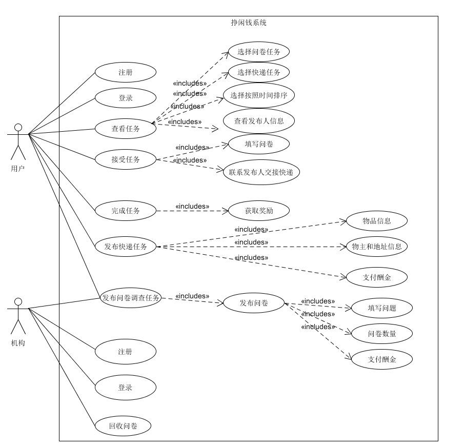

# 第一次迭代会议记录

`2019/4/27 20:00 - 21:20`

**会议目标：**
交流所做的调研和准备，讨论第一轮迭代阶段的任务

## 讨论内容
1. 就初次会议分配的任务，交流各自的调研结果。
2. 确定项目实现形式？
3. 确定项目具体业务流程，修改用例模型。
4. 讨论项目的人员分工
5. 确定下一步工作安排

## 讨论结果
1. 大家对于产品的定位有了更清晰的认识，了解到产品有一定市场需求，并就其竞争趋势做出了分析，具体的文档见主页

2. 项目实现形式：  
在各种实现形式之间进行斟酌比较，我们最终决定将其做成网页

3. 业务流程：  
此次会议，大家主要讨论了问卷调查的业务流程，并修改了上次会议的用例图   
此外，对于产品的支付功能，初步决定使用代币实现  
 

4. 项目分工：  
将所有人员初步分为两组，分别进行前端和后端的开发
* 前端：Yuefengxin， lvxm0， dongxy7
* 后端：170226， Chocoboeater， WaLittleMoon

5. 确定下一步工作安排  
我们打算采用前端React框架，后端MongoDB等实现，大家按照分组各自学习相关技术并练习，下面将正式进入前后端开发
