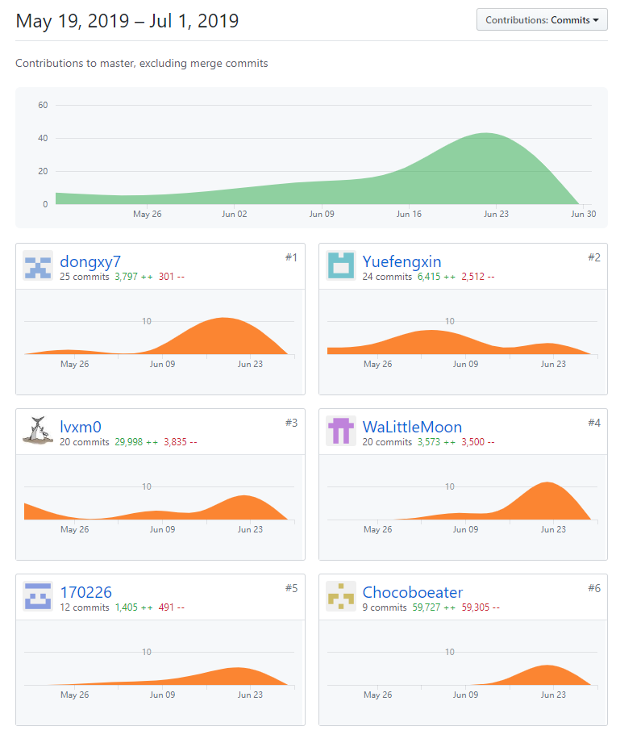

# 小组总结

## 小组成员

|   学号   |  GitHub昵称  |           GitHub账号            |分工|贡献率(合计100%)|
| :------: | :----: | :-----------------------------: |:--:|:--:|
|16340087|Yuefengxin|https://github.com/Yuefengxin|项目管理，UI设计，前端开发，项目文档整理|17.5%|
|16340164|lvxm0|https://github.com/lvxm0| UI设计，前端开发，架构设计|16.5%|
|16340092|WaLittleMoon|https://github.com/WaLittleMoon|后端开发，需求分析，交互设计|16.5%|
|16340110|chocoboeater|https://github.com/chocoboeater|后端开发，架构设计，交互设计|16.5%|
|16340077|170226|https://github.com/170226| 后端开发，架构设计，交互设计|16.5%|
|16340058|dongxy7|https://github.com/dongxy7| UI设计，前端开发，需求分析|16.5%|

## PSP2.1 汇总表

|      项目      | Yuefengxin | lvxm0 | WaLittleMoon | chocoboeater | 170226 | dongxy7 |
| :------------: | :--: | :----: | :----: | :----: | :----: | :----: |
|      计划      |   10   |       |   15    |    10    |   10    | 10 |
| * 估计任务时间 |   10  |       |     15  |    10    |   10    | 10 |
|      开发      |   100   |       |    70   |    80    |   80    | 98 |
|   * 分析需求   |   10   |       |   10    |   10     |   15    | 10 |
| * 生成设计文档 |   15   |       |    15   |    8    |   10    | 15 |
|   * 设计复审   |   5   |       |    8   |    5    |   5    | 5 |
|   * 代码规范   |   3   |       |    8   |    2    |   2    | 3 |
|   * 具体设计   |    12  |       |    10   |    5    |   10    | 10 |
|    * 具体编码     |   30   |       |   35    |    25    |   35    | 35 |
|   * 代码复审   |   10   |       |  20     |    5    |   5    | 5 |
|    * 测试      |   15   |       |   10    |    20    |    15   | 15 |
|    报告        |  10   |       |  15     |    10    |   10    | 10 |
|   * 测试报告   |   2   |       |    8   |    3    |    3   | 3 |
|  * 计算工作量  |   1   |       |    2   |    1    |    1   | 1 |
|  * 事后总结    |   7   |       |     8  |    6    |   5    | 6 |
|      合计      |   120   |  |    115    |    100    |    116    | 118 |

## 项目所有贡献图表截图

### 代码仓库

### 文档仓库

## 综合贡献度分配

| 制品       |                                                              | Yuefengxin | lvxm0 | WaLittleMoon | chocoboeater | 170226 | dongxy7 |
| ---------- | ------------------------------------------------------------ | ---- | ------ | ------ | ------ | ------ | ------ |
| 源代码     | 前端 | 34%  | 33%    |     |     |    | 33%     |
|      | 后端 |  |     | 34%    | 32%    | 34%    |     |
| 项目文档   | [文档](https://littlemiser.github.io/Dashboard/)                | 17.5%  | 16.5%     | 16.5%    | 16.5%     | 16.5%    | 16.5%    |
| 分析与设计 | UI设计                                                       | 34%  | 33%    |        | 33%    |        |        |
|   | 数据库设计                                                       |   |      | 34%    | 32%    | 34%    |        |
| 综合贡献   |                                                              | 17.5%  | 16.5%     | 16.5%    | 16.5%     | 16.5%    | 16.5%    |
