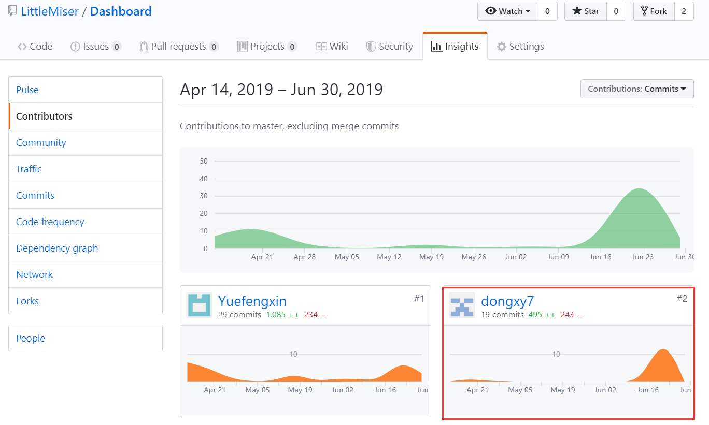
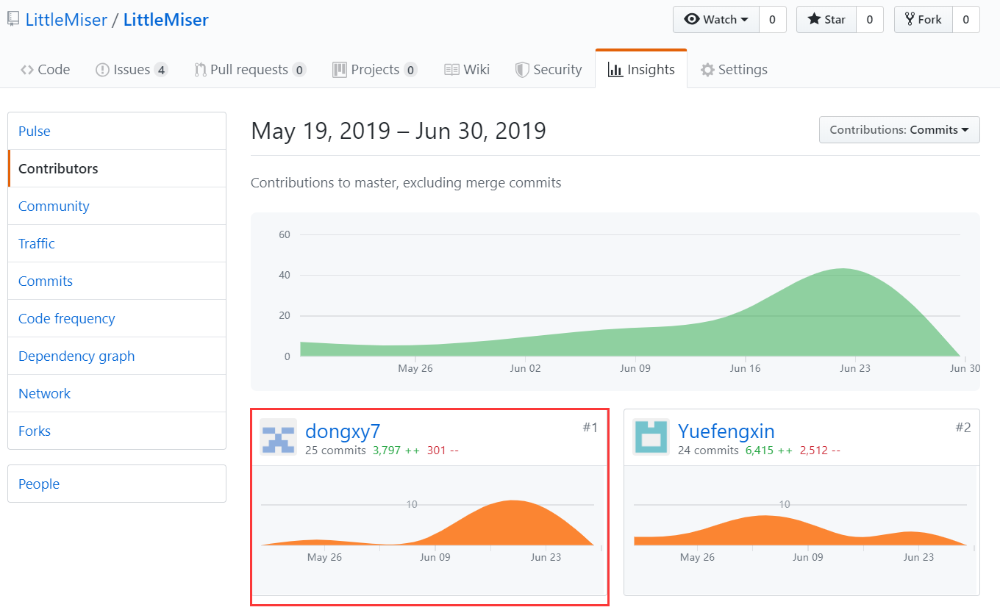

# 16340058 Final Report
## 1. 个人简短小结
在本次的系分的项目中主要负责前端部分。
- 学习并使用Vue框架，了解并引用semantic UI框架
- 完成任务管理（问卷管理，快递管理），个人信息管理，以及详情页面的设计与实现，并对接后端数据交互。完成任务管理（问卷管理，快递管理），个人信息管理，以及详情页面的设计与实现，并对接后端数据交互。
- 编写部分文档。

下面分项介绍在项目完成的内容。

### 分析
- 参与会议，同组员一起，进行前期调研，并分析需求。
- 分析产品特性，描述项目愿景，编写SWOT分析模型。

### 设计
- 和前端小伙伴一起设计UI界面，并使用Semantic UI框架
- 和前端小伙伴一起确定并使用前端框架Vue

### 开发
- 学习并使用Vue框架编写前端代码
- 开发编码完成任务管理（问卷/快递），个人信息管理与修改，以及快递详情。
- 进行数据绑定，方便与后端进行交互

## 2. PSP 2.1 统计
|**项目** | dongxy7  |
|:------:|:----:|
|**计划**|10  |
| * 估计任务时间| 10 |
|**开发**|98 |
| * 分析需求| 10 |
| * 生成设计文档| 15 |
| * 设计复审| 5 |
| * 代码规范| 3 |
| * 具体设计| 10 |
| * 具体编码| 35 |
| * 代码复审| 5 |
| * 测试| 15 |
|**报告**| 10  |
| * 测试报告| 3 |
| * 计算工作量| 1 |
| * 事后总结| 6 |
|合计| 118 |

### 3. 最得意/或有价值/或有苦劳的工作清单
- 解决部分Semantic UI框架中一些样式在与Vue中v-for结合时失效的一些bug
- 按时并相对提前完成前端部分，为后端交互提供支持。
- 绘制了每个用例的活动图。
- UI设计简洁大方，实用美观。

### 4. 在项目相关仓库中的贡献，仅需要截图
- DashBoard 文档集合
  

- LittleMiser 项目代码  
 

### 5. 个人博客清单
- [Vue初探](https://blog.csdn.net/weixin_43825621/article/details/93912112)

### 6. 特别致谢
- 潘茂林老师，课上讲解认真细致，并还课上现场绘图为我们演示，帮助我们进一步加深理解
- 前端小队其它成员[Yuefengxin](https://github.com/Yuefengxin)和[lvxm0](https://github.com/lvxm0)，大家互相协调合作，也技术上或其他方面也都帮助了我很多呀~
- 后端小队，非常细致认真，交互时共同合作解决bug，大家辛苦啦
- 团队中每位成员都辛苦啦！！大家都很棒棒哒~！

