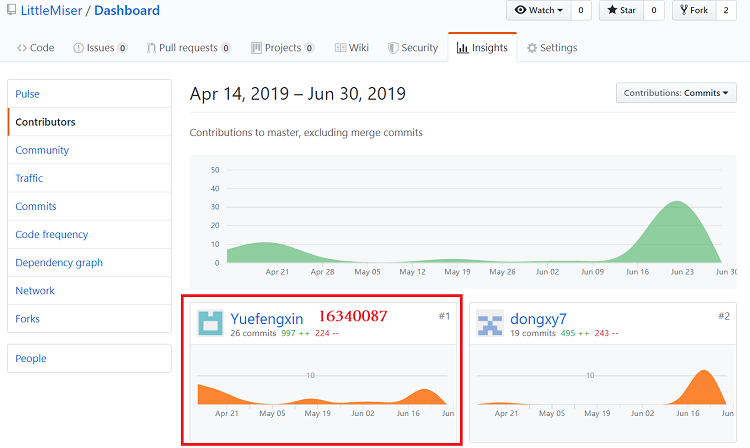
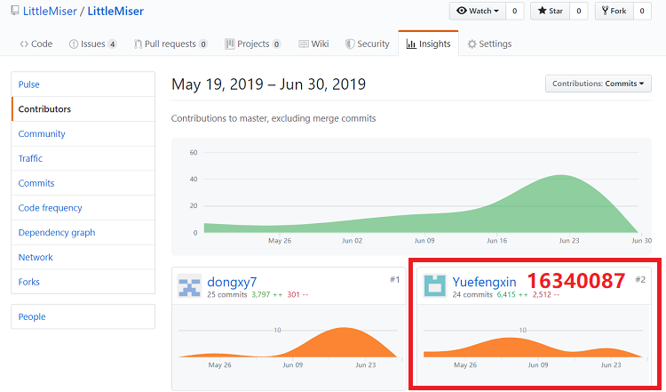

# 16340087 Final Report
## 1. 个人简短小结
作为项目经理和前端开发人员，我主要负责确定需求、管理团队，前端界面设计与开发，部分文档编写、画图等，投入的时间可以说相当多了。

总的来说，我觉得我在团队中最重要的贡献就是把所有成员都组织聚集起来，保证每个成员都有自己适当的工作，共同完成项目开发。

下面分项介绍我在项目完成的内容。
### 管理
- 组织每次迭代的会议，把大家召集起来共同商量项目开展，并记录每次讨论的结果，具体可见会议记录
    - [Inception meeting (2019/04/14)](../MeetingRecords/Inception-meeting.md)
    - [Iteration 1 meeting (2019/04/27)](../MeetingRecords/Iteration-1-meeting.md)
    - [Iteration 2 meeting (2019/05/12)](../MeetingRecords/Iteration-2-meeting-frontend.md)
    - [Iteration 3 meeting (2019/06/02)](../MeetingRecords/Iteration-3-meeting.md)
- 调整开发节奏，敦促大家按时产出。具体请参考项目 [KANBAN](https://github.com/orgs/LittleMiser/projects)
- 帮助前后台沟通，保证对接时顺畅。

### 分析
- 召集组员开会共同分析用户需求，吸收大家意见整理出最终的结果，绘制[用例图](../6-1-UsecaseDiagram.md)。
- 参与前端界面分析设计
- 在每次开会上推敲细节实现，实时检查组员进度，进一步分析并调整不合理的需求

### 设计
- 结合大家意见与自身想法，得出最终的[用例设计](../7-5-UsecaseDesign.md)
- 设计部分UI界面，详见[UIDesign](../7-1-UIDesign.md)。

### 开发
- 学习并使用Vue和Semantic UI框架进行前端开发
- 使用了Echarts图表插件绘制问卷统计图
- 与后端成员实时交互，解决问题

## 2. PSP2.1 统计
|      项目      | Yuefengxin | 
| :------------: | :--: | 
|      计划      |   10   |
| * 估计任务时间 |   10  |
|      开发      |   100   |
|   * 分析需求   |   10   |
| * 生成设计文档 |   15   |
|   * 设计复审   |   5   |
|   * 代码规范   |   3   |
|   * 具体设计   |    12  |
|    * 具体编码  |   30   |
|   * 代码复审   |   10   |
|    * 测试      |   15   |
|    报告        |  10   |
|   * 测试报告   |   2   |
|  * 计算工作量  |   1   |
|  * 事后总结    |   7   |
|      合计      |   120   |

## 3. 最得意/或有价值/或有苦劳的工作清单
- 组织每次迭代会议，与大家共同商量项目展开
- 为大家合理分配任务，敦促每人尽量按时产出
- 尽快地完成自己的前端部分，为后端对接人员预留充足时间
- 前端界面的设计，自身十分喜欢现在的风格，尤其是完全由自己设计编写的登录注册界面。此外设计了位置选择、时间选择菜单，以及统计的图表显示，自认为是十分友好的UI设计

## 4. 在项目相关仓库中的贡献
- DashBoard 文档集合
  

- LittleMiser 项目代码  
  

## 5. 个人博客清单
- [用Vue和ECharts绘制问卷统计结果](https://blog.csdn.net/sinat_36332694/article/details/94323199)
- [项目经理初体验](https://blog.csdn.net/sinat_36332694/article/details/94331928)

## 6. 特别致谢
- 系分课程潘老师 课上为我们讲解知识，以及实地展示绘图过程，让我们学到了很多
- 前端小队其它成员[dongxy7](https://github.com/dongxy7)和[lvxm0](https://github.com/lvxm0)，大家共同商量前端开发，想法也很合拍，都努力完成了自己的部分
- 后端小队与我对接的主要成员 [170226](https://github.com/170226)，十分积极地彼此沟通，很好的完成彼此的部分
- 当然团队的每一个人都辛苦了，谢谢大家坚持到最后！