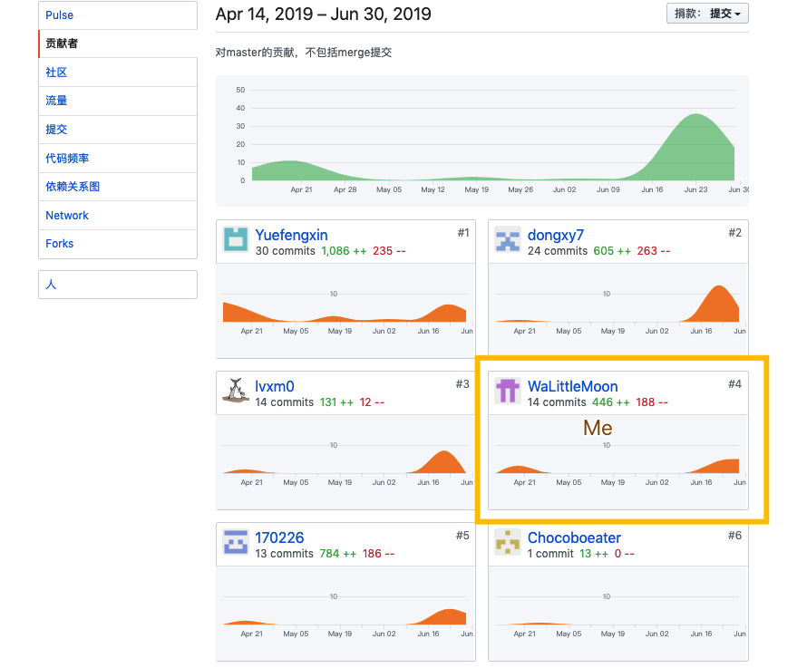
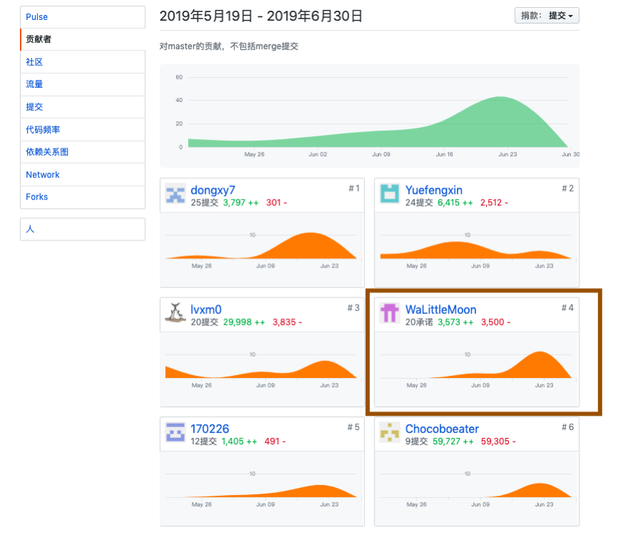

# 16340092 Final Report

## 简短的课程学习自我总结

作为后端小组成员，我主要负责**问卷部分后端设计**开发部分，以及部分文档的编写和图形绘制。

下面分项介绍我在项目完成的内容：

#### 分析

- 参与前期调研，参加小组会议，并分析用例需求
- 分析编写项目愿景

#### 设计

- 设计问卷表的数据库部分。
- 设计问卷创建，查询，删除，更新等 API。

#### 开发

- 设置axios中间件来响应 HTTP 请求。
- 使用 Nodejs 和 Express 框架开发
- 定义了路由表用于执行不同的 HTTP 请求动作
- 协同后端小组成员解决和用户信息的对接部分

------

## PSP2.1 表格

|      项目      | WaLittleMoon |
| :------------: | :----------: |
|      计划      |      15      |
| * 估计任务时间 |      15      |
|      开发      |      70      |
|   * 分析需求   |      10      |
| * 生成设计文档 |      15      |
|   * 设计复审   |      8       |
|   * 代码规范   |      8       |
|   * 具体设计   |      10      |
|   * 具体编码   |      35      |
|   * 代码复审   |      20      |
|     * 测试     |      10      |
|      报告      |      15      |
|   * 测试报告   |      8       |
|  * 计算工作量  |      2       |
|   * 事后总结   |      8       |
|      合计      |     115      |

## 最得意/或有价值/或有苦劳的工作清单

-  **最得意**：合适的问卷表的结构设计，方便查询和统计数据。
-  **最有价值**：小组成员间的相互配合，前后端的分开编写和两部分的对接工作。
-  **最有苦劳**：后端开发环境的选择和搭建。

------

## 个人GIT总结

#### Dashboard 文档集合

#### LittleMiser项目代码

## 个人博客清单

- [【学习笔记】MongoDB中与mysql的的区别](【学习笔记】MongoDB与Mysql的区别.md)
- [系统分析与设计一](https://blog.csdn.net/qq_36318771/article/details/88093433)
- [系统分析与设计二](https://blog.csdn.net/qq_36318771/article/details/88413052)
- [系统分析与设计三](https://blog.csdn.net/qq_36318771/article/details/89284390)
- [系统分析与设计四](https://blog.csdn.net/qq_36318771/article/details/89286808)
- [系统分析与设计五](https://blog.csdn.net/qq_36318771/article/details/89792293)
- [系统分析与设计六](https://blog.csdn.net/qq_36318771/article/details/89810006)
