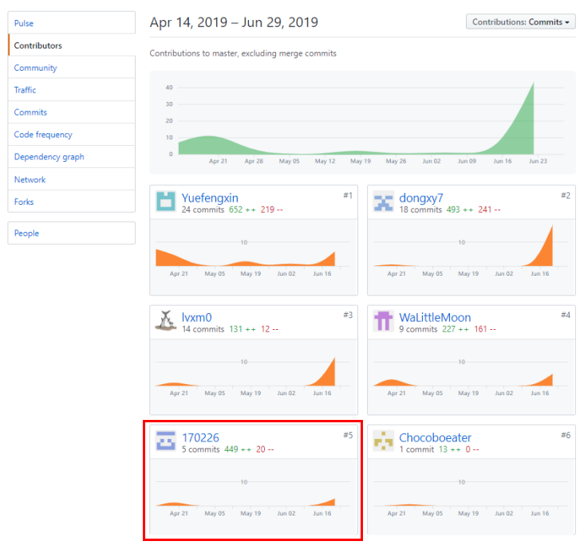
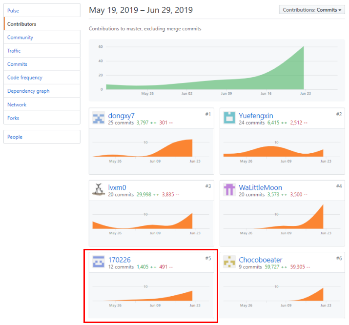

# 16340077 Final Report
## 1. 个人简短小结
作为后端小队成员，我主要负责数据库的设计，结合多种因素选取合适的后端技术框架与前端相对接，以及编码和编写部分文档。  

总的来说，我觉得我在团队中最重要的贡献就是最先开始后端代码部分的编写。由于我们每个成员的 Web 后端开发经验都比较少，我们一开始并不了解有哪些后端技术。因此，我起初花了比较长的时间来了解后端技术，最后考虑到实现难度以及我们每个成员的相关经验，选取了相对简单、参考文档比较多的技术框架。

下面分项介绍我在项目完成的内容。

### 分析
- 通过前期调研、参与会议并并与组员一起分析用户需求。
- 分析产品特性，编写用例故事。

### 设计
- 设计快递订单表的数据库部分。
- 设计快递查看、领取、管理等 API。

### 开发
- 使用 Node.js Express 框架开发 Web 后端
- 设置中间件来响应 HTTP 请求。
- 定义了路由表用于执行不同的 HTTP 请求动作。
- 使用 express.static 中间件来设置静态文件路径。

## 2. PSP2.1 表格  

|      项目      | 170226 | 
| :------------: | :--: | 
|      计划      |    10    |
| * 估计任务时间 |    10    |  
|      开发      |  80    | 
|   * 分析需求   |   15    |
| * 生成设计文档 |   10    |
|   * 设计复审   |   5    |
|   * 代码规范   |    2    |
|   * 具体设计   |   10    | 
|    * 具体编码    |  35    | 
|   * 代码复审   |   5    |  
|    * 测试      |   15   |
|    报告        |   10    | 
|   * 测试报告   |   3   | 
|  * 计算工作量  |   1   | 
|  * 事后总结    |   5    | 
|      合计      |   116    | 

## 3. 最得意/或有价值/或有苦劳的工作清单
- 选取后端技术框架。
- 首先实现前后端对接、连接数据库。
- 首先实现基本的快递创建功能，为之后的工作奠定了基础。
- 编写了可爱的用例故事。

## 4. 在项目相关仓库中的贡献
- DashBoard 文档集合
  
  

- LittleMiser 项目代码  
  

## 5. 个人博客清单
- [系统分析与设计——作业一](https://170226.github.io/2019/03/14/%E7%B3%BB%E7%BB%9F%E5%88%86%E6%9E%90%E4%B8%8E%E8%AE%BE%E8%AE%A1%E2%80%94%E2%80%94%E4%BD%9C%E4%B8%9A%E4%B8%80/#more)
- [系统分析与设计——作业二](https://170226.github.io/2019/03/28/%E7%B3%BB%E7%BB%9F%E5%88%86%E6%9E%90%E4%B8%8E%E8%AE%BE%E8%AE%A1%E2%80%94%E2%80%94%E4%BD%9C%E4%B8%9A%E4%BA%8C/#more)
- [系统分析与设计——作业三](https://170226.github.io/2019/04/14/%E7%B3%BB%E7%BB%9F%E5%88%86%E6%9E%90%E4%B8%8E%E8%AE%BE%E8%AE%A1%E2%80%94%E2%80%94%E4%BD%9C%E4%B8%9A%E4%B8%89/#more)
- [系统分析与设计——作业四](https://170226.github.io/2019/05/24/%E7%B3%BB%E7%BB%9F%E5%88%86%E6%9E%90%E4%B8%8E%E8%AE%BE%E8%AE%A1%E2%80%94%E2%80%94%E4%BD%9C%E4%B8%9A%E5%9B%9B/#more)
- [系统分析与设计——作业五](https://170226.github.io/2019/05/26/%E7%B3%BB%E7%BB%9F%E5%88%86%E6%9E%90%E4%B8%8E%E8%AE%BE%E8%AE%A1%E2%80%94%E2%80%94%E4%BD%9C%E4%B8%9A%E4%BA%94/#more)

## 6. 特别致谢
- 潘茂林老师 系统分析与设计课上为我们认真地讲解知识、传授经验，提供了许多宝贵的资料，使我了解了生产一个软件的大致流程，为我们的项目开发打下了理论基础。
- 项目经理 [Yuefengxin](https://github.com/Yuefengxin)，辛苦项目经理积极地组织我们参加会议，编写会议记录，极大地推动了项目的进度，使我们这些“拖延症患者”能够较为合理地每个时间段都有一定量的产出。
- 后端小队的每位成员 [Chocoboeater](https://github.com/Chocoboeater) 和 [WaLittleMoon](https://github.com/WaLittleMoon)，大家都积极地完成各自的任务，遇到问题相互协调、共同解决。
