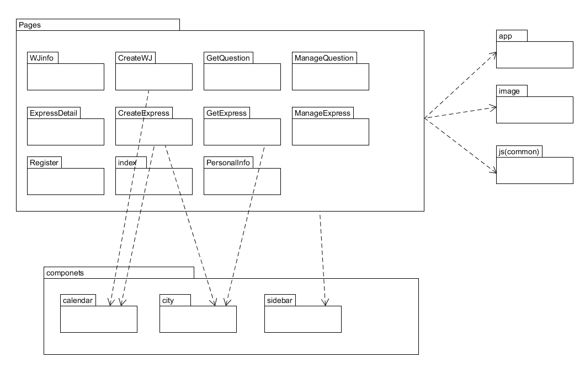

# 模块划分

根据业务逻辑功能与UI设计，将“小小财迷”（挣闲钱系统）前端主要概分为任务系统与账户管理系统。分为五个页面，其中又具体根据问卷和快递任务的不同细分两个子模块。每个页面中包含html文件，css文件以及js文件，分别处理页面布局，具体样式，以及逻辑事件的处理。

模块划分大致如下：
- 任务管理系统：
	- CreateTask：发布任务（快递/问卷）
		- 发布问卷
		- 发布快递
	- GetTask：领取任务（快递/问卷）
		- 领取问卷任务
			- 填写问卷
		- 领取快递任务
			- 快递详情页
	- ManageTask：管理任务（快递/问卷）
		- 管理问卷
			- 问卷结果回收，查看统计
		- 管理快递
			- 详情页面
- 账户管理系统：
	- Login/Register：组织或个人注册/登录
		- 注册页面
		- 登录页面
	- 个人信息管理
		- 密码变更
		- 信息更改
		- 资金管理（收入支出）
		
		
依据功能划分模块及页面，并完成后续的具体实现编码。
- 用到部分开源库和组件，例如日历组件，地理位置的省市区组件等。还有自定义相关组件，如显示任务内容的卡片等。
- 另外包括全局文件，配置文件等。
- 相关资源引用，如图片等。
- 公共引用部分，例如使用开源的Sematic时需要的相关js文件。

