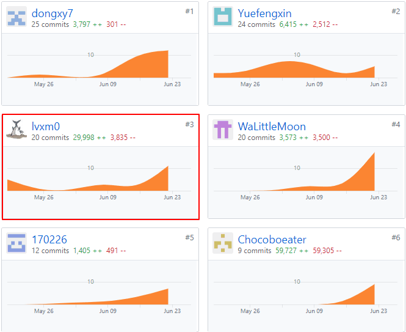
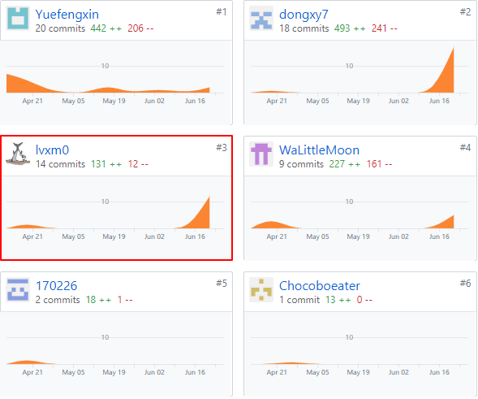

#  Final Report

**16340164 吕雪萌 前端开发**

### 学习收获

- 自学 Vue.js 语法结构
- 熟练使用 Semantic UI
- 体会到前后端分离开发的重要性
- 体验团队合作开发的过程，熟练使用git
- 团队沟通的重要性

在这个项目中我负责实现侧边栏，选择发布页面，问卷创建页面，问卷填写页面以及部分文档的完成。

在小组会议中，我们聚在一起进行需求分析，模块设计，分配工作到个人，大家一起通力合作完成了整个项目，非常有成就感。

### 特别感谢

**超级感谢每一个同学** ！大家在一起完成项目特别愉快！小组的每个人都很认真的完成了自己的部分，而且及时沟通。再次感谢  **Yuefengxin** 同学啦，组织开小组会议，做会议记录辛苦啦！ 

- Chocoboeater
- Yuefengxin
- WaLittleMoon
- dongxy7
- 170226

### 统计表

| PSP2.1                                | Personal Software Process Stages      | Time (%) Senior Student |
| ------------------------------------- | ------------------------------------- | ----------------------- |
| **Planning**                          | **计划**                              | 7                       |
| Estimate                              | 估计这个任务需要多少时间              | 7                       |
| **Development**                       | **开发**                              | 85                      |
| Analysis                              | 需求分析 (包括学习新技术)             | 11                      |
| Design Spec                           | 生成设计文档                          | 6                       |
| Design Review                         | 设计复审 (和同事审核设计文档)         | 5                       |
| Coding Standard                       | 代码规范 (为目前的开发制定合适的规范) | 4                       |
| Design                                | 具体设计                              | 15                      |
| Coding                                | 具体编码                              | 30                      |
| Code Review                           | 代码复审                              | 4                       |
| Test                                  | 测试（自我测试，修改代码，提交修改）  | 10                      |
| **Reporting**                         | **报告**                              | 8                       |
| Test Report                           | 测试报告                              | 0                       |
| Size Measurement                      | 计算工作量                            | 2                       |
| Postmortem & Process Improvement Plan | 事后总结, 并提出过程改进计划          | 6                       |

### 个人分支的GIT统计报告

**前端**

**Document**

### 自认为最得意/或有价值/或有苦劳的工作清单，含简短说明

Vue.js框架学习，Semantic-UI的使用，动态DOM的实现，日历控件的使用。
